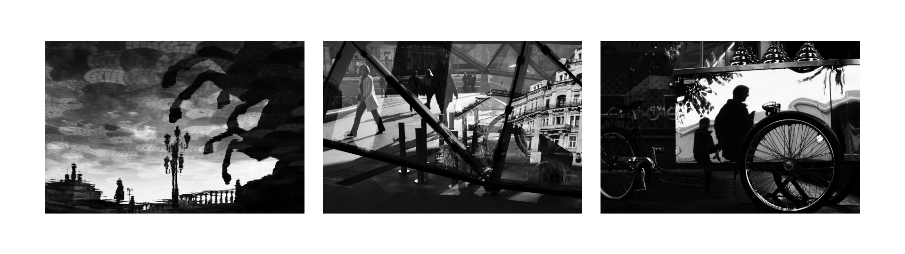
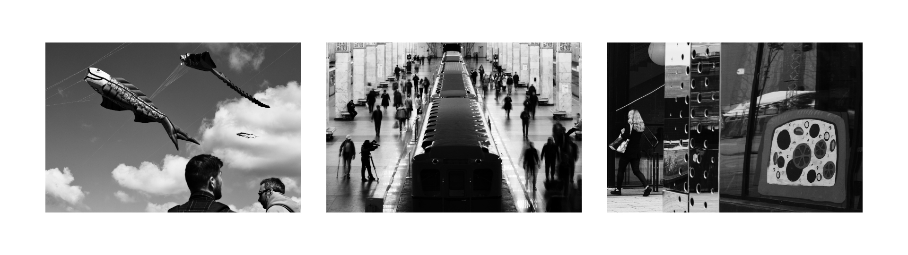

# Street Monochrome

Black and white darktable styles for street photographers.

## Overview

### S (standard)

This is a high contrast style. It doesn't emulate any existing film, although you can find some parallels with the JCH StreetPan 400 or with the pushed Kodak Tri-X 400 film stocks. In most situations it'll work better for the underexposed images. Protect the highlights, embrace the shadows, and it'll work as intended. Don't be afraid to lower the exposure.

### L (landscape)

The L version makes the blues darker and keeps more details in the shadows and the highlights. Usually it makes the street photos look softer even though the technical contrast is almost the same as in the standard style. It makes the sky darker, it doesn't emphasize the objects in the foreground as much. It makes the bright reflections of the sky darker, they stand out less. It adds some details to the silhouettes, they are not as inky black as before. In the result, the images tend to look softer overall.

### F (flat)

The F version has the noticeable 50% mask on the `rgb curve`. It reduces the overall contrast a lot, but keeps the character. The blue tones are getting darker as well. In the result we can get more dynamic range and save the details in both the shadows and the highlights. This style is good for more old-school documentary photography.

### FN (flat natural)

The FN style is the variant of the F style, but without any color corrections at all. It's just a flat style with the most natural color rendering.

### LC, FC, FNC (clean)

These versions don't use the mask on the rgb curve. The contrast is reduced by the standard `contrast` slider. In the result, we lose some of the darkness in the shadows and get some contrast in the midtones instead. The images will look more detailed, more clean overall. These styles can help in the situations when the standard L, F, FN styles give us too muddy results.

### 0 (zero)

This style includes every module that can't be saved as LUT. You can use one of the LUTs + this 0 style and the combination will work as a normal style.

### 0SM

This style includes the `rgb curve` + `monochrome` modules. Basically, it's the heart of the whole pack of these styles. It makes the character. If you want to use this curve somewhere else for some reason - this style is for you.

### Effects

There are some additional effects here:

#### + extra crispy

This effect adds even more contrast to the highlights. It can be required in some cases of printing. But use it carefully - this kind of effect can create visible artifacts with outlines.

## Usage

These styles are designed to be applied in the **display-referred** workflow **after the standard base curve** of the camera, so technically they'll work with any camera with the slight differences in the dynamic range.

*Tip: If you need to increase the exposure - consider using the `color balance rgb > global brilliance` slider instead of the one in the `exposure` module. It'll change the contrast in the relation to the exposure changes, and everything will look more natural. The standard `exposure` module works if you need to fix the overexposed areas, but if you need to make a photo a little bit brighter - it can raise the shadows too much and change the character of the photo. The `global brilliance` slider doesn't affect the shadows as much.*

The additional LUT files are created to use the same styles in the different editing programs, with JPEG files, or just to get the fast previews of the photos. For obvious reasons, the LUTs does not include the denoise settings, clarity and sharpening effects, so a little lack of microcontrast is expected in comparison with the normal styles.

## License

CC BY 4.0

Copyright (c) 2023 Ivan Bogachev

https://instagram.com/sfi0zy
