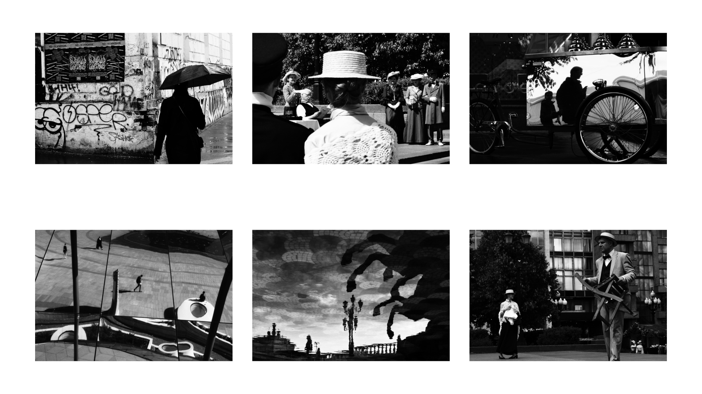
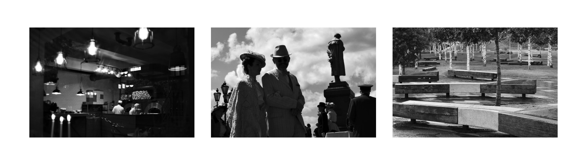

# Street Monochrome

Black and white styles for the darktable.

## Examples

### Standard

This is a high contrast style. It doesn't emulate any existing film, although you can find some parallels with the JCH StreetPan 400 or with the pushed Kodak Tri-X 400 film stocks. In most situations it'll work better for the underexposed images. Protect the highlights, embrace the shadows, and it'll work as intended.

### F

The F version has the mask on the `rgb curve`. It reduces the overall contrast, but keeps the character. The blue tones are getting darker as well. In the result we can get the most dynamic range possible and save the details in both the shadows and the highlights. This style is good for more old-school documentary photography.

## Usage

These styles are designed to be applied in the **display-referred** workflow after the standard base curve of the camera, so technically they'll work with any camera with the slight differences in the dynamic range.

If you need to tweak the exposure - use the `color balance rgb > global brilliance` slider instead of the one in the `exposure` module. It'll change the contrast in the relation to the exposure changes, and everything will look more natural.

The additional LUT files are created to use the same styles in the different editing programs, with JPEG files, or just to get the fast previews of the photos. For obvious reasons, the LUTs does not include the denoise settings, clarity and sharpening effects, so a little lack of microcontrast is expected in comparison with the normal styles.

## License

CC BY 4.0

Copyright (c) 2023 Ivan Bogachev

https://instagram.com/sfi0zy
