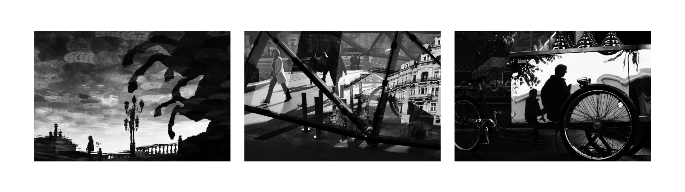
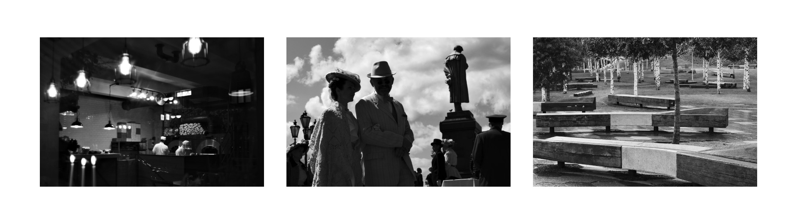
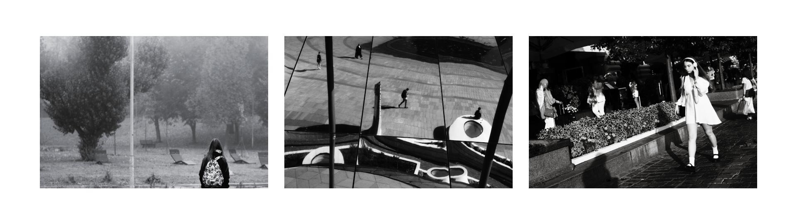
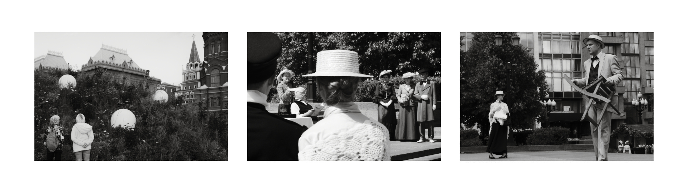
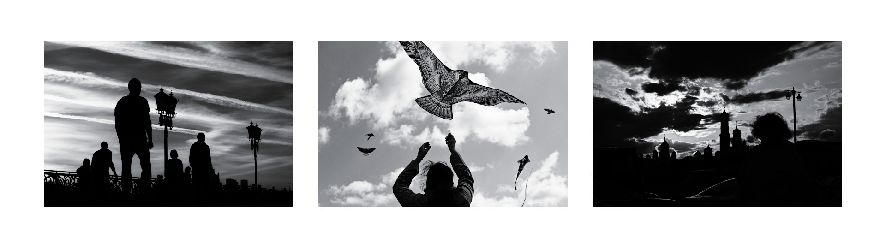

# Street Monochrome

Black and white darktable styles for street photographers.

## Usage

These styles were created for the darktable v4. Although they include all sorts of modules, they are designed to be applied in the **display-referred** workflow after the default workflow modules (after the base curve). Because of that most of the styles can be used with the JPG files as well as RAW files.

*Tip: You can change the default workflow in the `settings > processing > auto apply pixel workflow defaults > display referred (legacy)`.*

### Step 0. RAW.

The styles in the first step are related to the RAW files.

These styles include modules that can't be saved as LUT - `demosaic`, `denoise`, `white balance`, `color calibration`, `raw chromatic aberrations`, `contrast equalizer` and `sharpen`. One of them should be used as the base. They don't change the overall look of the images that much, but they can help with the texture. If your camera requires any special preparations - consider changing them. If you want to just get the look, but not to play with anything else - you can just skip this first step.

#### Modern

This is the standard base. Some denoise, some sharpening, some other tweaks. Nothing special. Makes the image cleaner in comparison to the default darktable settings.

#### Vintage

This style turns off the `sharpen` module and uses the `contrast equalizer` to add some blur to the image. Not much, but enough to make the modern oversharpened image look more natural. If you don't have the AA filter on the sensor and want to make images look softer - this base is for you.

*Tip: If you have an old computer and it has troubles working with these modules in real time - consider editing/retouching the photos first and enabling the base styles later.*

### Step 1. Look.

These styles create the look of the street monochrome. The additional LUT files are created to use the same styles in the different editing programs, with JPEG files, or just to get the fast previews of the photos.

#### Standard

This is a high contrast style with a lot of blacks. It doesn't emulate any existing film, although you can find some parallels with the JCH StreetPan 400 or with the pushed Kodak Tri-X 400 film stocks. In most situations it'll work better for the underexposed images. Protect the highlights, embrace the shadows, and it'll work as intended. Don't be afraid to lower the exposure.

*Tip: If you need to increase the exposure - consider using the `color balance rgb > global brilliance` slider instead of the one in the `exposure` module. It'll change the contrast in the relation to the exposure changes, and everything will look more natural. The standard `exposure` module works if you need to fix the overexposed areas, but if you need to make a photo a little bit brighter - it can raise the shadows too much and change the character of the photo. The `global brilliance` slider doesn't affect the shadows as much.*

#### Landscape

The landscape version makes the blues darker and keeps more details in the shadows and the highlights. Usually it makes the street photos look softer even though the technical contrast is almost the same as in the standard style. It makes the sky darker, it doesn't emphasize the objects in the foreground as much. It makes the bright reflections of the sky darker, they stand out less. It adds some details to the silhouettes, they are not as inky black as before. In the result, the images tend to look softer overall.

*Tip: If you want to make the highlights even softer with this style - consider using the `color balance rgb > highlights gain` slider.*

#### Flat

The flat version has the noticeable 50% mask on the `rgb curve`. It reduces the overall contrast a lot, but keeps the character. The blue tones are getting darker as well. In the result we can get more dynamic range and save the details in both the shadows and the highlights.

This style is good for night photography and documentary photography. Usually, it works well with the vintage base.

### Step 2. Effects.

There are some additional effects here. Due to their nature they cannot be saved as LUTs.

#### + dodge and burn

This effect turns on the shadows and highlights module and makes the shadows darker and the highlights lighter (by default this module does everything in the opposite direction). Since it has the softening radius, the overall effect is different from the other exposure-related modules. It works somewhat similar to the classical dodging and burning process. It forms the existing light in the scene. It's a bit rough, but it'll do the job in the most cases.

#### + gradient ND2 bottom

This effect creates a ND2 gradient at the bottom of the frame (75% if we count it from the top) and rotates it 180 degrees, so it makes the bottom darker. In street photography this effect comes in handy when the floor is too bright in comparison to the other objects in the scene. For some reason all the standard presets for the gradient module make the top part of the frame darker instead.

### Step 3. Toning.

#### + cyanotype 5%, + sepia 3%

These are the toning effects. They are barely noticeable, but they can make a great impact on the viewer. There is no recipe for every situation here, but in general the sepia effect tends to make the shadows look deeper and the photo look warmer overall, and the cyanotype tends to make the photos look clean, cold and modern.

The left photo in the example has the cyanotype toning, the middle one is a 100% black and white image, the right one has the sepia toning.

## Recipes

Here you'll find some recipes. They'll help you get the idea how to combine the styles to get the different results.

### Warm Vintage

vintage + flat + dodge and burn + sepia 3%

### Icy Modern

modern + standard + cyanotype 5%

## License

CC BY 4.0

Copyright (c) 2024 Ivan Bogachev

https://instagram.com/sfi0zy
