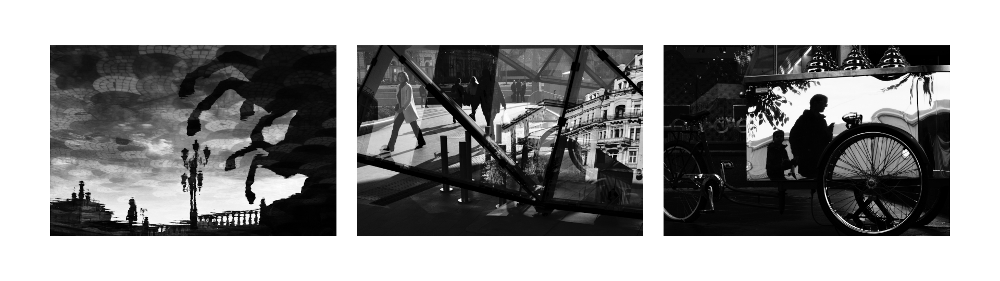
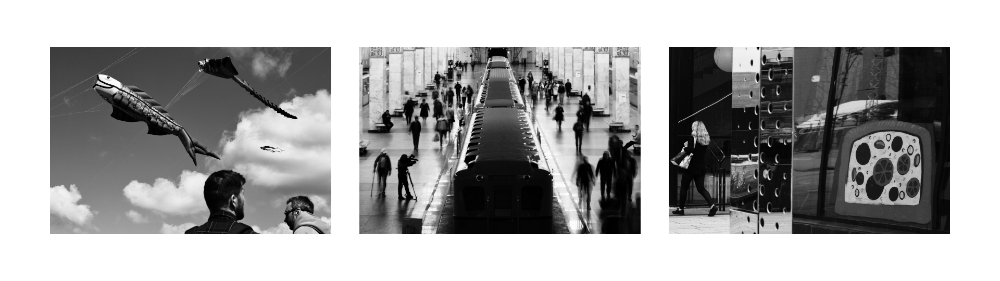
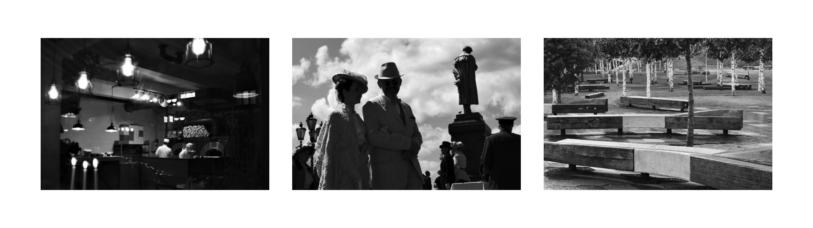
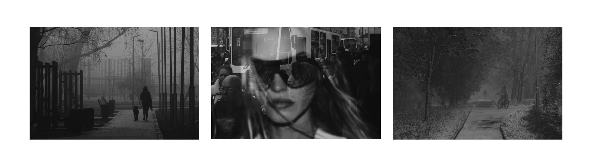
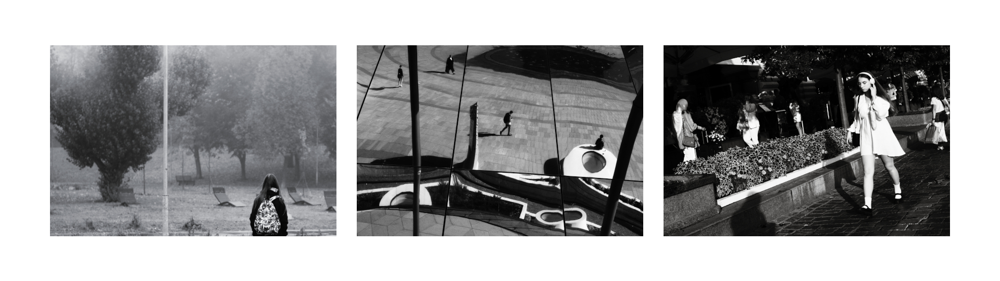
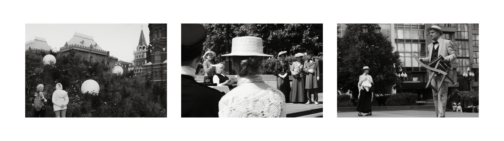
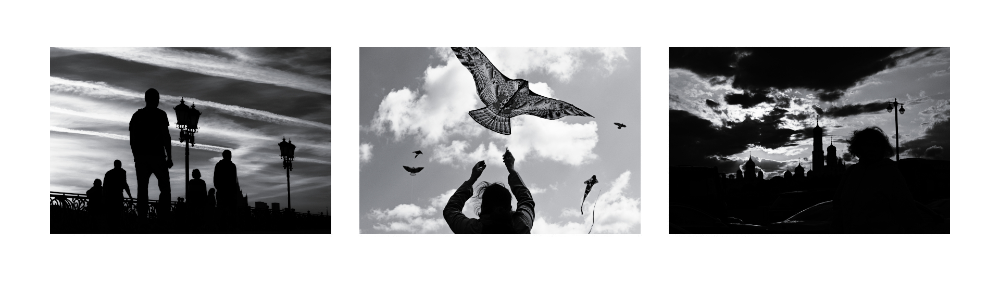

# Street Monochrome

Black and white darktable styles for street photographers.

## Usage

These styles were tested in darktable v4 and v5. Although they include all sorts of modules, they are designed to be applied in the **display-referred** workflow after default workflow modules (after a base curve). Because of that, most of the styles can be used with JPG files as well as RAW files.

*Tip: You can change the default workflow in `settings > processing > auto apply pixel workflow defaults > display referred (legacy)`.*

### Step 1. Look.

These styles create the overall look of street monochrome. All of them utilize the same set of modules - `color balance rgb`, `rgb curve`, `color zones`, and `monochrome`. We can switch between them easily.

Additional LUT files are created to use the same styles in different editing programs, with JPEG files, or just to get fast previews.

They are sorted from the brightest one to the darkest.

#### Standard

This is a high contrast style with a lot of blacks. It doesn't emulate any existing film, although you can find some parallels with JCH StreetPan 400 or with a pushed Kodak Tri-X 400 film stocks. In most situations it'll work better for underexposed images. Protect the highlights, embrace the shadows, and it'll work as intended. Don't be afraid to lower the exposure.

*Tip: If you need to increase exposure - consider using the `color balance rgb > global brilliance` slider instead of the one in the `exposure` module.*

#### Landscape

The landscape version makes blues darker and keeps more details in shadows and highlights. Usually it makes street photos look softer even though the technical contrast is almost the same as in the standard style. You may think about this style like it's a standard style with a red filter. Although it doesn't work like a real filter, the overall effect is similar in many ways. It makes the sky darker, so it doesn't emphasize objects in the foreground as much. It makes bright reflections of the sky darker, so they stand out less. It adds some details to silhouettes, so they are not as inky black as before. In the result, images tend to look softer overall.

*Tip: If you want to make highlights even softer with this style - consider using the `color balance rgb > highlights gain` slider.*

#### Flat

The flat version has a noticeable 50% mask on the `rgb curve`. It reduces the overall contrast a lot, but keeps the character. It's somewhat similar to the discontinued Agfa APX 25 film. Blue tones are getting darker, like in the landscape style. In the result, we can get more dynamic range and save details in both the shadows and the highlights.

In some cases, this style may look too flat, but it's a good choice for night photography and old school documentary photography. Usually, it works well with a vintage base.

#### Eerie

The eerie version pushes the overall balance towards dark grey tones. It adds some Leica Monochrom vibes while keeping some of the character of the street monochrome styles. This is a good choice for moody foggy days, dark parks, and, in some cases, sunny days as well. It'll help to deal with harsh sunlight. If the standard and landscape styles feel way too contrasty, and the flat looks burned out - eerie is a way to go.

*Tip: This style can be a good starting point to play with `brilliance` sliders in the `color balance rgb` module.*

### Step 2. Effects.

There are some additional effects here.

#### + dodge and burn

This effect turns on the `shadows and highlights` module and makes shadows darker and highlights lighter (by default this module does everything in the opposite direction). Since it has a softening radius, the overall effect is different from other exposure-related modules. It works somewhat similar to the classical dodging and burning process. It forms existing light in the scene. It's a bit rough, but it'll do the job in most cases.

*Tip: If you have a scene with a lot of details and shapes, like tree branches, try to play with the `radius` and `compress` sliders of the `shadows and highlights` module. Smaller radius and compress value less than 50% can help to form those shapes in a couple of clicks.*

#### + gradient ND2 bottom

This effect creates an ND2 gradient at the bottom of the frame (75% if we count it from the top) and rotates it 180 degrees, so it makes the bottom darker. In street photography, this effect comes in handy when the floor is too bright in comparison to other objects in the scene. For some reason, all the standard presets for the `graduated density` module make the top part of the frame darker instead.

#### + cyanotype 5%, + sepia 3%

These are toning effects. They use the `split-toning` module and are applied afterwards, on top of the monochrome image. They are barely noticeable, but they can make a great impact on the viewer. There is no recipe for every situation here, but in general the sepia effect tends to make shadows look deeper and make photos look warmer overall, and the cyanotype tends to make photos look clean, cold and modern.

The left photo in this example has a cyanotype toning, the middle one is a 100% black and white image, the right one has a sepia toning.

### Step 3 (optional). RAW Texture.

These styles are related to RAW files.

They include modules that can't be saved as LUT - `demosaic`, `denoise`, `sigmoid`, `raw chromatic aberrations`, `contrast equalizer` and `sharpen`. One of them should be used as a base for RAW files. They don't change the overall look of the images that much, but they can help with the texture. If your camera requires any special preparations - consider changing them.

*Tip: Algorithms in this step are quite demanding. If you have an old computer and it can't work with these modules in real time - consider editing/retouching your photos first and enabling these styles at the very end.*

#### Modern

This is a standard base. Some denoise, some sharpening, some other tweaks. Nothing special. Makes an image a bit cleaner in comparison to the default darktable settings.

*Tip: The black point can be moved a bit here and it will cause underexposure. Be aware of that!*

#### Vintage

This style turns off the `sharpen` module and uses the `contrast equalizer` to add some blur to the image. Not much, but enough to make a modern oversharpened image look more soft and natural.

#### Muddy

This base is for photos created in darkness. ISO 51200 kind of darkness. We would not expect any fine details here. The modern base can look a bit edgy because of the random white pixels and not detailed enough at the same time. This style changes the `demosaic` algorithm and the `denoise` settings in order to get a different kind of grain. It's deep, but smooth, without any sharp edges. In normal scenarios, it'll make photos look very messy, but when we work with insanely high ISO, it does the opposite and makes them look cleaner and more detailed in some cases.

## Recipes

Here you'll find some recipes. They'll help you get an idea how to combine these styles to get different results.

### Warm Vintage

flat + dodge and burn + sepia 3% + vintage

### Icy Modern

standard + cyanotype 5% + modern

## Layout

We don't really need all of the darktable modules to be on the screen while using Street Monochrome. Some of them can come in handy - `crop`, `rotate and perspective`, `exposure`, `retouch`, maybe `grain`. But the rest of them are not that useful. In order to make work easier, you may choose to use a custom module layout. It'll have just two tabs - one for active modules, they will be added to the list automatically, and a second one for a short list of some other modules, complementing them.

To import this layout, go to `preferences > presets > modulegroups`. You'll see all the layouts you have. Use the `import` button to import the Street Monochrome layout from `./presets/modulegroups` directory. It'll be shown there. You can always choose a layout, edit or remove them in the menu of the `modulegroups` module.

## License

CC BY 4.0

Copyright (c) 2026 Ivan Bogachev

https://instagram.com/sfi0zy
